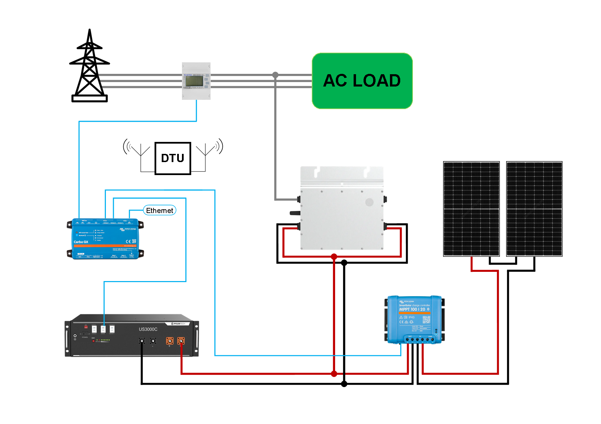
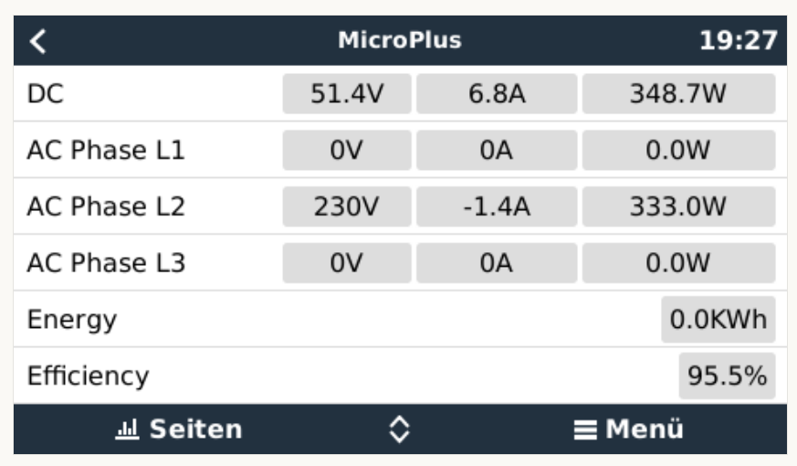

# dbus-hoymiles
Integrate Hoymiles microinverters into Victron Energies Venus OS

## Purpose
With the scripts in this repo it should be easy possible to install, uninstall, restart a service that connects Hoymiles microinverters to the VenusOS and GX devices from Victron. 

The script can be used with inverters connected to solar panels as well as with inverters connected to a battery. It provides functions to regulate the output power of the inverters to realize a zero export system.


As interface between the GX device and the Hoymiles microinverter OpenDTU or Ahoy is used:
- https://github.com/tbnobody/OpenDTU
- https://github.com/lumapu/ahoy

## How it works
### System diagram


### My setup
- 3-Phase installation
- Venus OS on Raspberry PI (Minimum version V3.42)
- PYLONTECH LiFePO4 Battery
  - Connected over CAN with Waveshare RS485 CAN HAT for Raspberry Pi
- Victron SmartSolar MPPT charge controller
  - Connected over VE.Direct to USB interface  
- Hoymiles HM-600 
  - Connected over https://github.com/lumapu/ahoy
  - Shelly1pm as additional power meter connected over https://github.com/Telekatz/venus.dbus-shellyPlug
- SDM630 used as a grid meter
  - Connected over https://github.com/Telekatz/venus.dbus-modbus-eastron

### Pictures




## Install & Configuration
### Get the code
Just grab a copy of the main branch and copy them to a folder under `/data/` e.g. `/dbus-hoymiles`.
After that call the install.sh script.

The following script should do everything for you:
```
wget https://github.com/telekatz/venus.dbus-hoymiles/archive/refs/heads/main.zip
unzip main.zip "venus.dbus-hoymiles-main/*" -d /data
mv /data/venus.dbus-hoymiles-main /data/dbus-hoymiles
chmod a+x /data/dbus-hoymiles/install.sh
/data/dbus-hoymiles/install.sh
rm main.zip
```

Before installing a new version, uninstall the installed version:
```
/data/dbus-hoymiles/uninstall.sh
```

### Change config.ini
Within the project there is a file `/data/dbus-hoymiles/config.ini`. Create a new section for each inverter to be created.

| Section  | Config value | Explanation |
| ------------- | ------------- | ------------- |
| DEFAULT | Logging | Log level for file log. |
| DEFAULT | InverterCount | Number of inverters. |

### Inverter settings
The following settings are available in the device settings menu of the inverter inside Venus OS:

| Config value | Explanation |
| ------------- | ------------- |
| Role | Mode of operation for the inverter. Valid values PV inverter (Input of inverter is connected to solar panels) or AC load (Input of inverter is connected to a battery). |
| Position | Only for PV inverter. Valid values AC input 1, AC input 2 or AC output: Position where the inverter is connected.
| Enabled | Enables the use of the inverter. |
| Maximum Inverter Power | Maximum power of the inverter. |
| Phase | Valid values L1, L2 or L3: represents the phase where inverter is feeding in. |
| MQTT URL | IP address of the MQTT server. |
| MQTT Port | Port of the MQTT server. |
| MQTT User | Username for the MQTT server. Leave blank if no username/password required. |
| MQTT Password | Password for the MQTT server. Leave blank if no username/password required. |
| MQTT Inverter Path | Path on which the DTU publishes the inverter data. |
| DTU | Type of the DTU. |
| Inverter ID | Number of the inverter in Ahoy. |
| Restart inverter at midnight | Restarts the inverter at midnight to reset the yield day counter. |

### Battery inverter settings
If the mode of at least one inverter is set to AC load, an additional device called MicroPlus is created that emulates a Multiplus and combines all inverters with the mode AC load into a battery inverter. The ESS settings are also available with this device. This device cannot be used in a system that already has a Multiplus/Quattro installed.
The following settings are available in the settings menu of the MicroPlus device:

| Config value | Explanation |
| ------------- | ------------- |
| Startup Limit | Limits the AC power of the inverter to the generated PV power. |
| Startup Limit Min | Initial limit. |
| Startup Limit Max | Ends the limitation as soon as the generated PV power reaches this value. |
| Feed-In Limit Mode | Selection of the feed in limit mode. |
| Grid Target Power | Target power for grid import. |
| Grid Target Fast Deviation | Threshold deviation for slow/fast inverter regulation. |
| Grid Target Fast Interval | Minimum inverter power change interval when the deviation from the `Grid Target Power` > `Grid Target Fast Deviation` |
| Grid Target Slow Interval | Minimum inverter power change interval when the deviation from the `Grid Target Power` < `Grid Target Fast Deviation` |
| Base Load Period | Observation period for base load mode. |
| Inverter Minimum Interval | Minimum interval between limit changes. |
| Power Meter | Use of an external power meter instead of internal inverter power meters for the total power. The role of the external power meter must be AC load. |
| Inverter DC Shutdown Voltage | Disables the inverter when the battery voltage falls to or below this value. |
| Inverter DC Restart Voltage | Battery voltage from which the inverter can be activated again. |


### Feed-In limit modes

| Mode | Explanation |
| ------------- | ------------- |
| Maximum Power | Inverter power is set to `Maximum Inverter Power`. |
| Grid Target | Imported power from the grid will be regulated to the `Grid Target Power`. A new limit is set at regular intervals depending on the `Grid Target Fast Deviation`, `Grid Target Fast Interval` and `Grid Target Slow Interval` settings. |
| Base Load | Inverter Power will be regulated to the lowest load power during the past `Base Load Period`. |
| Venus OS | Inverter Power will be regulated by Venus OS. |
| External | Inverter Power can be regulated by writing the limit to the path `/<DeviceInstance>/Ac/PowerLimit` of the dbus service `com.victronenergy.vebus`. |

## Used documentation
- https://github.com/victronenergy/venus/wiki Victron Energies Venus OS
- https://github.com/victronenergy/venus/wiki/dbus DBus paths for Victron namespace
- https://github.com/victronenergy/venus/wiki/dbus-api DBus API from Victron
- https://github.com/tbnobody/OpenDTU/blob/master/README.md OpenDTU user manual
- https://github.com/lumapu/ahoy/blob/main/Getting_Started.md Ahoy DTU user manual


