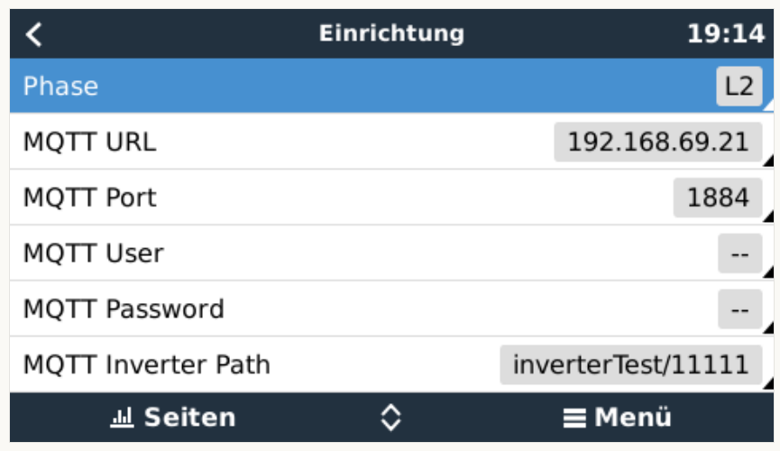

# dbus-hoymiles
Integrate Hoymiles microinverter into Victron Energies Venus OS

## Purpose
With the scripts in this repo it should be easy possible to install, uninstall, restart a service that connects a Hoymiles microinverter to the VenusOS and GX devices from Victron. 

As interface between the GX device and the Hoymiles microinverter the Ahoy DTU is used:
https://github.com/lumapu/ahoy/tree/main/tools/esp8266


## Inspiration
This project is my first on GitHub and with the Victron Venus OS, so I took some ideas and approaches from the following projects - many thanks for sharing the knowledge:
- https://github.com/vikt0rm/dbus-shelly-1pm-pvinverter
- https://github.com/Marv2190/venus.dbus-MqttToGridMeter


## How it works
### My setup
- 3-Phase installation
- Venus OS on Raspberry PI (Minimum version V2.92)
- PYLONTECH LiFePO4 Battery
  - Connected over CAN with Waveshare RS485 CAN HAT for Raspberry Pi
- Victron SmartSolar MPPT charge controller
  - Connected over VE.Direct to USB interface  
- Hoymiles HM-600 
  - Connected over https://github.com/lumapu/ahoy/tree/main/tools/esp8266
  - Shelly1pm as additional power meter
- SDM630 used as a grid meter
  - Connected over https://community.victronenergy.com/idea/114716/power-meter-lib-for-modbus-rtu-based-meters-from-a.html


### Pictures





## Install & Configuration
### Get the code
Just grab a copy of the main branch and copy them to a folder under `/data/` e.g. `/dbus-hoymiles`.
After that call the install.sh script.

The following script should do everything for you:
```
wget https://github.com/telekatz/venus.dbus-hoymiles/archive/refs/heads/main.zip
unzip main.zip "venus.dbus-hoymiles-main/*" -d /data
mv /data/venus.dbus-hoymiles-main /data/dbus-hoymiles
chmod a+x /data/dbus-hoymiles/install.sh
/data/dbus-hoymiles/install.sh
rm main.zip
```


### Change config.ini
Within the project there is a file `/data/dbus-hoymiles/config.ini` - normally no changes are necessary.

| Section  | Config value | Explanation |
| ------------- | ------------- | ------------- |
| DEFAULT  | SignOfLifeLog  | Time in minutes how often a status is added to the log-file `current.log` with log-level INFO |
| DEFAULT  | Deviceinstance | Unique ID identifying the inverter in Venus OS |

### Inverter settings
The following settings are available in the device settings menu inside Venus OS:

| Config value | Explanation |
| ------------- | ------------- |
| Maximum Inverter Power | Maximum power of the inverter |
| Phase | Valid values L1, L2 or L3: represents the phase where inverter is feeding in |
| MQTT URL | IP address of the MQTT server |
| MQTT Inverter Path | Path on which Ahoy DTU publishes the inverter data |
| Startup Limit | Limits the AC power of the inverter to the generated PV power until inverter maximum power is reached |
| Feed-In Limit Mode | Selection of the feed in limit mode (Maximum Power, Grid Target Power or Base Load) |
| Grid Target Interval | Minimum power change interval for grid target mode |
| Grid Target Power | Target power for grid import |
| Grid Target Tolerance Minimum | Maximal allowed lower deviation from the target grid power |
| Grid Target Tolerance Maximum | Maximal allowed upper deviation from the target grid power |
| Base Load Period | Observation period for base load mode |
| Activate Shelly | AC output of inverter is connected to a Shelly1pm |
| Shelly Power Meter | Use of Shelly1pm power meter instead of internal inverter power meter |
| Shelly IP Address | IP address of the Shelly1pm |
| Shelly User Name | Username for htaccess login - leave blank if no username/password required |
| Shelly Password | Password for htaccess login - leave blank if no username/password required |

### Feed-In Limit Modes

| Mode | Explanation |
| ------------- | ------------- |
| Maximum Power | Inverter power is set to `Maximum Inverter Power` |
| Grid Target | Imported power from the grid will be regulated to the `Grid Target Power`. New limit will be set, if the grid power exceeds the limits specified by `Grid Target Tolerance Minimum` and `Grid Target Tolerance Maximum`. `Grid Target Interval` specifies the minimum time interval between two limit changes. |
| Base Load | Inverter Power will be regulated to the lowest load power during the past `Base Load Period`. |


## Used documentation
- https://github.com/victronenergy/venus/wiki  Victron Energies Venus OS
- https://github.com/victronenergy/venus/wiki/dbus  DBus paths for Victron namespace
- https://github.com/victronenergy/venus/wiki/dbus-api   DBus API from Victron
- https://github.com/grindylow/ahoy/blob/main/tools/esp8266/User_Manual.md  Ahoy DTU user manual
- https://shelly-api-docs.shelly.cloud/gen1/#shelly1-shelly1pm Shelly API documentation


